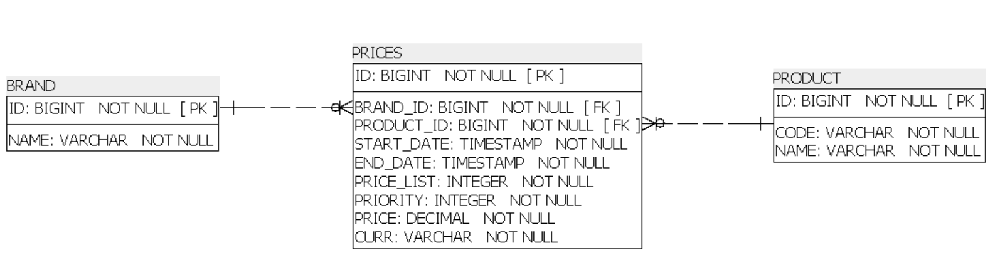

# ECOMMERCE Micro Service #

Short description, explaining service purpose.

### Available endpoints ###

#### Prices
* `GET   /prices?brandId=<brandId>&productId=<productId>&date=<date>&sortBy=<sortBy>&sortDirection=<sortDirection>&page=<page>&size=<size>`: get a prices by params

### Data Model ###
This service depends on the following data model

* `Brand`: holds data related to Brands. 

* `Product`: holds data related to Products.

* `Prices`: this holds the binding between Brands and Products to define the final price.

### Running your service ###
The entry point for this application is located in the class `ServiceApplication`.
* The local server will be accessible from the address: `http://localhost:8080/ecommerce`
* The local server for swagger ui: `http://localhost:8080/ecommerce/swagger-ui.html#/`
* The local database will be accessible from the address: `http://localhost:8080/ecommerce/h2`